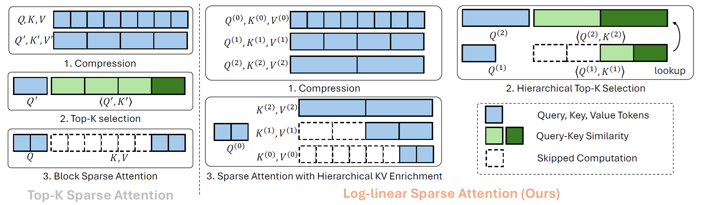

<h1 align="center"><strong> Log-linear Sparse Attention </strong></h1>
<p align="center">
    <a href="https://zhouyifan.net/about/">Yifan Zhou<sup>1</sup></a>,
    <a href="https://github.com/xizaoqu">Zeqi Xiao<sup>1</sup></a>,
    <a href="https://github.com/wtybest">Tianyi Wei<sup>1</sup></a>,
    <a href="https://williamyang1991.github.io/">Shuai Yang<sup>2</sup></a>, and
    <a href="https://xingangpan.github.io/">Xingang Pan<sup>1</sup></a>  
    <br>
    <sup>1</sup>S-Lab, Nanyang Technological University  
    <br>
    <sup>2</sup>Wangxuan Institute of Computer Technology, Peking University
</p>


<strong>Paper:</strong> <a href="https://arxiv.org">https://arxiv.org</a>  
<br>
Official pyTorch implementation of Log-linear Sparse Attention (LLSA)


<p align="center">
    
</p>

---

## Updates

- **[12/2025]**: Code released.

## Installation

1. Clone the repository:

    ```bash
    git clone git@github.com:SingleZombie/LLSA.git
    cd LLSA
    pip install -e .
    ```

2. Install PyTorch in your Python environment.

3. Install the required Python libraries:

    ```bash
    pip install -r requirements.txt
    ```

## Minimum Usage
Replace the standard scaled dot-product attention with LLSA:

```diff
from llsa.kernel.torch_op.flash_sparse_attention_res_2 import llsa_l2

- attn_output = hidden_states = F.scaled_dot_product_attention(
-                query, key, value, dropout_p=0.0, is_causal=False)

+ attn_output = llsa_l2(q, k, v, topk=8, block_size=16)
```

> **Note:**  
> - The current implementation supports only non-causal attention.  
> - The token length and `topk` must be powers of 2.  
> - Future updates will address these limitations.

## Preprocessing for Non-Sequential Data

For non-sequential data (e.g., images or videos), we recommend reordering the data so that similar tokens have adjacent indices.

Please check the example in `src/llsa/models/rope_dit_transformer_2d.py`

```python
def gen_permuatations(log_num_tokens: int):
    # num_tokens = 4 ** (1 + log_num_tokens)
    perm = torch.tensor([[0, 1], [2, 3]])
    base_num = 4

    for i in range(log_num_tokens):
        length = perm.shape[-1]
        perm = perm[None, :, :].expand(
            4, -1, -1) + torch.arange(0, 4)[:, None, None] * base_num
        perm = perm.reshape(2, 2, length, length)
        perm = rearrange(perm, 'a b c d -> a c b d')
        perm = perm.reshape(length * 2, length * 2)

        base_num *= 4

    perm = perm.flatten()
    inv_perm = torch.empty_like(perm)
    inv_perm[perm] = torch.arange(len(perm))
    return perm, inv_perm

class DiT():
    def init():
        ...

        self.fwd_perms = {}
        self.bwd_perms = {}

        for log2_scale in range(2, 10):

            img_size = 2 ** log2_scale
            log_scale_m1 = log2_scale - 1
            perm, inv_perm = gen_permuatations(int(log_scale_m1))
            self.fwd_perms[img_size] = inv_perm
            self.bwd_perms[img_size] = perm
    
    def forward():
        ...

        batch_size, _, height, width = hidden_states.shape
        patch_height = height // self.patch_size

        fwd_perm = self.fwd_perms[patch_height].to(hidden_states.device)
        hidden_states = hidden_states[:, fwd_perm, :]

        # attention blocks
        ...

        bwd_perm = self.bwd_perms[patch_height]
        hidden_states = hidden_states[:, bwd_perm, :]

        ...
```

## Pure Pixel DiT Training

In the paper, we validate LLSA on pure pixel DiT **(no VAE, no patchification)** generation up to $512 \times 512$ resolution. Currently, we provide an example of FFHQ-128 DiT training with LLSA.

### Genenerate FID Log

```bash
python gen_fid_log.py configs/training/train_rope_dit_S_32_rms.json ffhq_32.pth
python gen_fid_log.py configs/training/train_rope_dit_S_128_rms_ft_llsa_l2.json ffhq_128.pth
```

### Trainining FFHQ-32 model

```bash
python train.py configs/training/train_rope_dit_S_32_rms.json
# or
# accelereate launch train.py configs/training/train_rope_dit_S_32_rms.json
```

### Trainining FFHQ-128 model

```bash
python train.py configs/training/train_rope_dit_S_128_rms_ft_llsa_l2.json
# We provide a DiT with full attention for comparison
# python train.py configs/training/train_rope_dit_S_128_rms_ft.json
```

### Evaluate FID on More Samples

```bash
python test_fid.py configs/training/train_rope_dit_S_128_rms_ft_llsa_l2.json ffhq_128.pth \
    --n_sample_data_batch 200 \
    --valid_batch_size 50
```

## Acknowledgements

* [Diffusers](https://github.com/huggingface/diffusers): Our project is built on diffusers.